+++
date = '2025-04-08T21:25:53-07:00'
draft = false
title = 'Week 2 - Styling and Refactors'
+++

[Check out the completed GitHub repo for this week](https://github.com/jdgio2/cs-club-portfolio-w2)

## Objective

-   Clean up component structure a bit.
-   Install Tailwind into our project.
-   Use Tailwind to style the Hero and Header sections.

Today, we're going to turn our website from this 🤢:


Into this:
(results may vary slightly based on how cracked you are)


## Steps

### Refactoring Project Structure

We're going to start off by refactoring what we already have. Your project structure probably just has everything slapped into the `/src` folder. Let's just clean it up a bit so it's easier to navigate our project. You don't have to organize it in this way---this is just what I find most helpful.

1. Open your previous portfolio project in VSCode. Or, copy a completed template from [this link.](https://github.com/jdgio2/cs-club-portfolio-w1) If you're cloning, make sure to run `npm install` in the terminal once you open the project in VSCode.
2. Use `npm run dev` in the terminal to preview your project. Take a look at it again, it's probably been a second.
3. If you haven't already, delete the file `App.css`. Do not delete `index.css`.
4. Make a new folder in `/src` called `components`.
5. Drag everything into the folder except `main.jsx`, `App.jsx`, and `index.css`.
6. Update the imports inside `App.tsx`. They used to be:

```jsx
import About from "./About";
import Header from "./Header";
import Hero from "./Hero";
import Projects from "./Projects";
import Skills from "./Skills";
import Footer from "./Footer";
```

Since we moved everything, we want to change it to this instead:

```jsx
import About from "./components/About";
import Header from "./components/Header";
import Hero from "./components/Hero";
import Projects from "./components/Projects";
import Skills from "./components/Skills";
import Footer from "./components/Footer";
```

7. Reload your preview page in your browser to make sure it's working. It should look the same as before.

### TAILWIND TIME 🎉🎉🎉

Our website still looks like garbage. Let's add Tailwind so we can make it look slightly better. Let me warn you: we are not going to be able to cover all of Tailwind today. You can create crazy, complex, beautiful websites with Tailwind. All these setup instructions were pulled from [tailwindcss.com](https://tailwindcss.com/).

1. Stop your development terminal by pressing `ctrl+c` (it might be `cmd+c` on a Mac).
2. Copy and paste this into your terminal and hit enter: `npm install tailwindcss @tailwindcss/vite`.
3. Update your Vite configuration in `vite.config.js`. Change it from this:

```js
import { defineConfig } from "vite";
import react from "@vitejs/plugin-react";

// https://vite.dev/config/
export default defineConfig({
    plugins: [react()],
});
```

to this:

```js
import { defineConfig } from "vite";
import react from "@vitejs/plugin-react";
import tailwindcss from "@tailwindcss/vite"; // new import

// https://vite.dev/config/
export default defineConfig({
    plugins: [react(), tailwindcss()], // new plugin
});
```

4. Go into `index.css` and paste in the following line:

```css
@import "tailwindcss";
```

5. Make sure you've saved all your changes, and then type `npm run dev` into the console again and re-open your preview. Your website should now look like this:
   

Tailwind is now working! If you're wondering more about how tailwind actually works, then you can go to [the additional content explaining the differences](#additional-content-normal-css-vs-tailwindcss)

6. Go to the extensions tab in your VSCode and download the Tailwind CSS Intellisense extension. It makes your life working with Tailwind ten times easier through autocomplete and suggestions.
   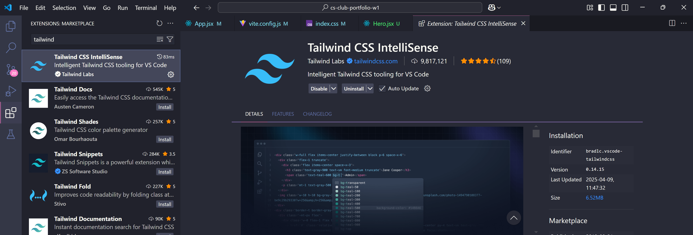

Let's start styling!

# Styling with TailwindCSS

We're just going to style the Hero section for now, and then I am going to just let you go off and do your own thing and style away.

I'm going to loosely copy this format for the hero that I got from an AI somewhere:


You can break this image down into two sections: the left side with the image, and the right side with the text and buttons. And indeed, when we take a look at the HTML using the inspection tool, that is what we see. There are two containers (blue) separated by a little bit of gap between them (purple dotted lines):
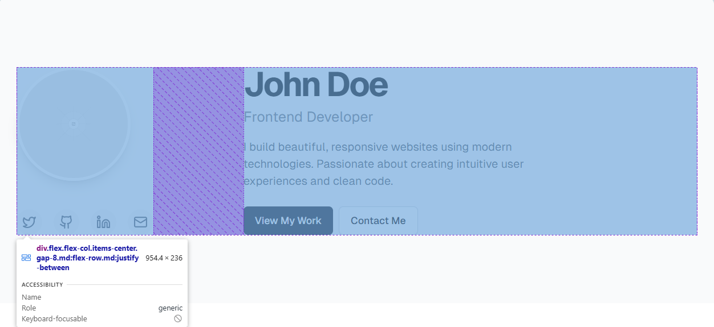

By default, putting elements in a web page puts them one on top of another. Sometimes, we want it to not act that way. I want to put two elements in my page and have them be side by side! They did that above using **flexbox**.

As a general rule in modern CSS, whenever we want to place two items next to each other, our beloved utility [_flexbox_](https://developer.mozilla.org/en-US/docs/Web/CSS/CSS_flexible_box_layout/Basic_concepts_of_flexbox) will come into play. It's a style you assign to an element---say a div---which then makes it so that any element you place within that div will be side by side (or on top of each other, or even reversed side by side! There are a ton of variations you can change based on settings you put into your flexbox).

Let's get into it!

1. First, I wanted an image in my `Hero.jsx` component. I went ahead and got some images of a beloved professor and added them to my `/public` directory. I also changed the text in my `p` element to match the AI example a bit better, going from this:

```jsx
// Hero.jsx
export default function Hero() {
    return (
        <section id="hero">
            <div className="hero-content">
                <h1>Hi, I'm [Your Name]</h1>
                <p>
                    A full-stack developer who builds web apps that solve real
                    problems.
                </p>
                <a href="#contact" className="cta-button">
                    Contact Me
                </a>
            </div>
        </section>
    );
}
```

to this:

```jsx
// Hero.jsx
export default function Hero() {
    return (
        <section id="hero">
            <div className="hero-content">
                
                <h1>Hi, I'm Dr. Guzi</h1>
                <p>Full-Stack Developer</p>
                <a href="#about" className="cta-button">
                    About Me
                </a>
            </div>
        </section>
    );
}
```

My image is very large, so it's taking up my entire screen. I had to zoom out just to get this picture of what it looks like now.
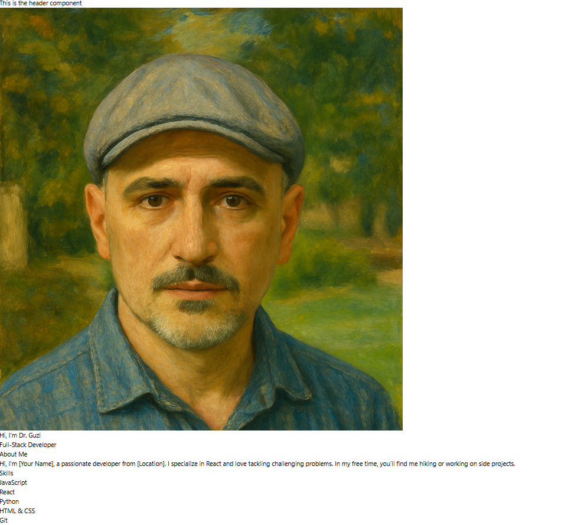

Let's shrink the image! `img` elements have properties on them (`width` and `height`) which let you set the width and height manually, so you can do that if you like. But this is a good opportunity to use Tailwind for the first time, so let's do that instead!

3. Apply a `className` property to the `img` element (this is identical to applying a class to an element in HTML, React just uses the keyword "className" instead of "class").

4. Enter `w-96` into the quotes around the className. The `img` element should now look like this:

```jsx

```

saving our changes will reveal a site that now has a much more manageable image size:

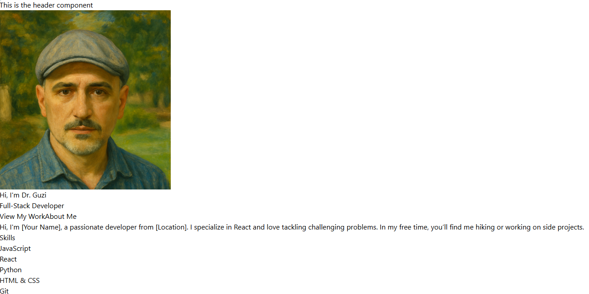

What did we just do? Well, Tailwind is what is called a "utility-first" approach to CSS. That just means that instead of having to style everything from scratch, Tailwind provides a bunch CSS styles already done for you which you can slap onto any element you like, always using `className` like we just did. In our case, we took the style which affects width (hence the "w" in "w-64") and applied it to our element, thus changing the width of our image!

There are other width options too, like `w-1`, `w-2`, and so on. I chose `w-96` arbitrarily, but you can choose ANY of the plethora of options for your own website. The Tailwind CSS Intellisense should bring up a menu like the one shown below to give you ideas, and there are **a LOT**:
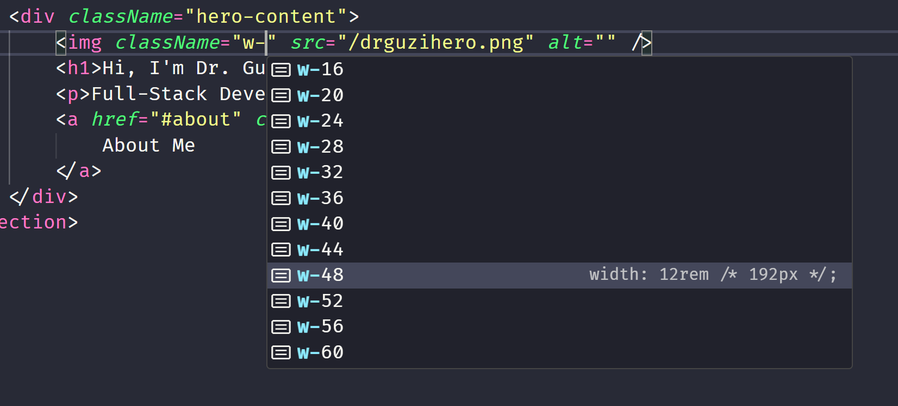

Don't worry about memorizing them, though. That's what the extension and Google are for. Now that we know how to apply styles to an element using the `className` property, let's step it up a notch and do some more advanced styling involving positioning.

As a refresher, here's what our site looks like now:


and here's an approximation of what we're trying to achieve:


We want the image to be to the left of our text, with the text and buttons all still landing on top of each other. Let's do that now using our knowledge of HTML and flexbox.

First up, we know we want a container on the left and on the right. The left container holds the image, and the right container holds the text, buttons, and everything else.

5. Wrap your `img` element in a div, and then wrap the remaining `h1`, `p`, and `a` elements in another div like so:

```tsx
// Hero.jsx
export default function Hero() {
    return (
        <section id="hero">
            <div className="hero-content">
                <div>
                    
                </div>
                <div>
                    <h1>Hi, I'm Dr. Guzi</h1>
                    <p>Full-Stack Developer</p>
                    <a href="#about" className="cta-button">
                        About Me
                    </a>
                </div>
            </div>
        </section>
    );
}
```

6. If you haven't already, add the other button for "View My Work" while you're at it:

```tsx
// Hero.jsx
export default function Hero() {
    return (
        <section id="hero">
            <div className="hero-content">
                <div>
                    
                </div>
                <div>
                    <h1>Hi, I'm Dr. Guzi</h1>
                    <p>Full-Stack Developer</p>
                    <a href="#projects" className="pj-button">
                        View My Work
                    </a>
                    <a href="#about" className="cta-button">
                        About Me
                    </a>
                </div>
            </div>
        </section>
    );
}
```

Your site should look the exact same. But as soon as we go to the parent div and include the `flex` class in its className, then everything should change.

7. Add the class `flex` to the parent div---the one with the pre-existing className of `hero-content`---and hit save.

```tsx
// Hero.jsx
export default function Hero() {
    return (
        <section id="hero">
            <div className="hero-content flex">
                {/* omitted */}
                {/* omitted */}
                {/* omitted */}
            </div>
        </section>
    );
}
```

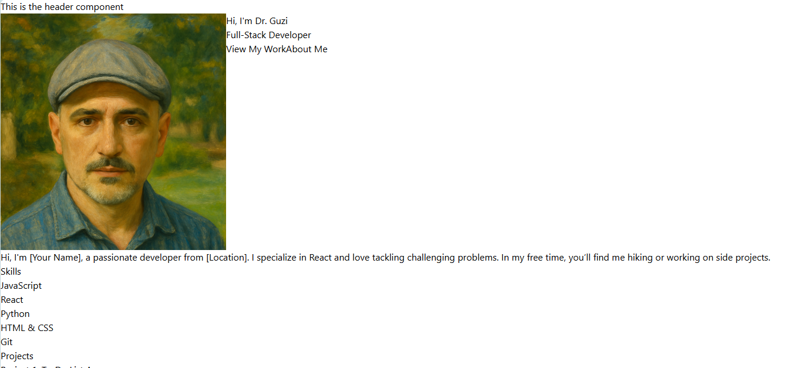

Hey, that's pretty close! We have the image on the left and the text on the right just how we wanted. There are still a few problems we need to fix, though:

#### 1. The entire section only takes up a little bit of the screen. It's not eye-catching to have our hero the same size as the rest of our sections.

#### 2. The image and text look like garbage when they're just sitting on the left of the page. They should be centered.

#### 3. The image and the text are right next to each other, but there should be some space between them.

#### 4. Dr. Guzi's image is square right now, but should be a circle.

#### 5. The text should look have different font weights and colors.

#### 6. Where my buttons at?

The best part about fixing all of these is that there's nothing else to add, really. It's all just classNames and pure Tailwind from this point on, so lets fix them one at a time in a bit of a speedrun fashion since explaining each and every class I apply to stuff won't be super useful. However, the classes you're about to see here encompass about 80% of what you'll use in Tailwind on a daily basis, so use this as a reference.

### 1. The entire section only takes up a little bit of the screen. It's not eye-catching to have our hero the same size as the rest of our sections.

All we need to do to fix this is add a height class to our Hero component. We want it to take up the entire screen, and luckily, Tailwind has a class for that: `h-screen`.

```jsx
// Hero.jsx
export default function Hero() {
    return (
        <section id="hero">
            <div className="hero-content flex h-screen">
                {/* omitted */}
                {/* omitted */}
                {/* omitted */}
            </div>
        </section>
    );
}
```

The hero section now takes up the entire screen and the other elements have been pushed further down.

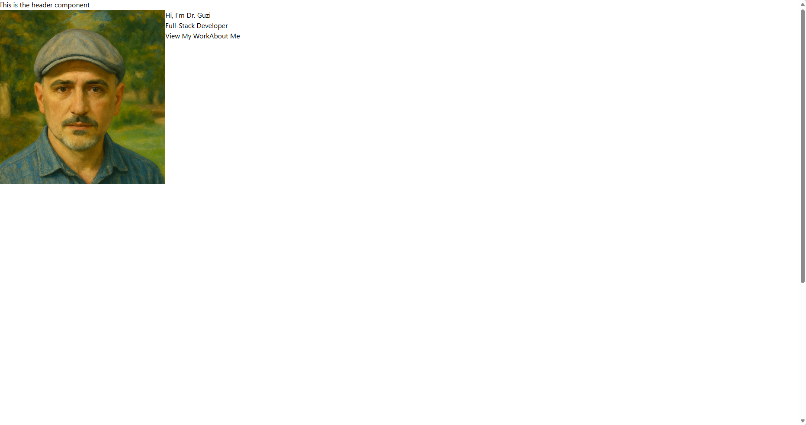

### 2. The image and text look like garbage when they're just sitting on the left of the page. They should be centered.

To fix this, we just need to add some classes which center. `justify` classes are used for alignment along the horizontal (or main) axis and `items` classes are used for alignment along the vertical (or cross) axis. Combined, we center our items perfectly in the middle.

```jsx
// Hero.jsx
export default function Hero() {
    return (
        <section id="hero">
            <div className="hero-content flex h-screen justify-center items-center">
                {/* omitted */}
                {/* omitted */}
                {/* omitted */}
            </div>
        </section>
    );
}
```

Beautifully centered!

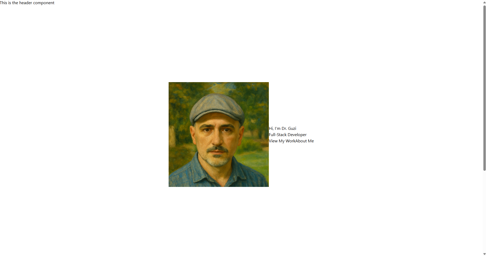

### 3. The image and the text are right next to each other, but there should be some space between them.

If only there were something that, oh I don't know, could put a gap between our elements! Maybe the `gap` class would work!

```jsx
// Hero.jsx
export default function Hero() {
    return (
        <section id="hero">
            <div className="hero-content flex h-screen justify-center items-center gap-50">
                {/* omitted */}
                {/* omitted */}
                {/* omitted */}
            </div>
        </section>
    );
}
```

By jove!

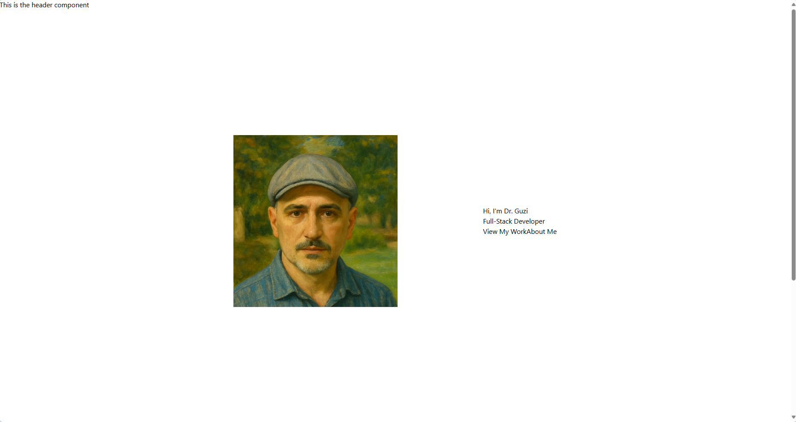

### 4. Dr. Guzi's image is square right now, but should be a circle.

This is just one simple class. We can just use the `rounded` class to round the corners of any rectangle. Since we want this to be circular, we can use `rounded-full` for it to round it 100%.

```jsx
// Hero.jsx
export default function Hero() {
    return (
        <section id="hero">
            <div className="hero-content flex h-screen justify-center items-center gap-50">
                <div>
                    
                </div>
                <div>
                    {/* omitted */}
                    {/* omitted */}
                    {/* omitted */}
                </div>
            </div>
        </section>
    );
}
```

Almost there!

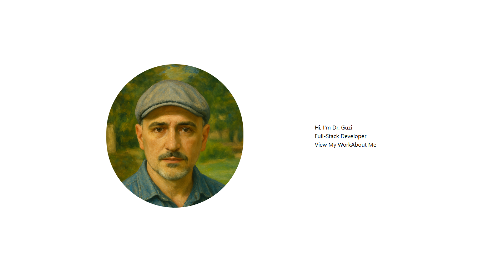

### 5. The text should look have different font weights and colors.

For text, you have two primary classes: `font` and `text`. Tailwind `font-` classes change the font weight (like `font-bold`), while `text-` classes control font size, color, and alignment (like `text-xl`, `text-red-500`, `text-center`). So one’s about how thick the text is, the other’s about how it looks and sits.

Compared to our reference image, the top text looks just about as bold as it can go and is also massive. The text below is just a little smaller, less bold, and is a shade of grey rather than black. Let's add it.

```jsx
// Hero.jsx
export default function Hero() {
    return (
        <section id="hero">
            <div className="hero-content flex h-screen justify-center items-center gap-50">
                <div>{/* omitted */}</div>
                <div>
                    <h1 className="font-black text-6xl">Hi, I'm Dr. Guzi</h1>
                    <p className="text-4xl text-gray-500">
                        Full-Stack Developer
                    </p>
                    {/* omitted */}
                </div>
            </div>
        </section>
    );
}
```


I also thought the text was a little close together, so I ended up adding the `gap-` to their parent div. Since `gap-` requires a flex container to work, but I still wanted everything to stack vertically, I used `flex` and `flex-col` as well as putting both buttons into their own container so that they could still end up side by side.

```jsx
// Hero.jsx
// Hero.jsx
export default function Hero() {
    return (
        <section id="hero">
            <div className="hero-content flex h-screen justify-center items-center gap-50">
                <div>
                    {/* omitted */}
                </div>
                <div className="flex flex-col gap-4"> // added gap here
                    <h1 className="font-black text-6xl">Hi, I'm Dr. Guzi</h1>
                    <p className="text-4xl text-gray-500">
                        Full-Stack Developer
                    </p>
                    <div> // new div here
                        <a
                            href="#projects"
                            className="pj-button bg-gray-800 text-white font-semibold px-4 py-3 rounded-lg"
                        >
                            View My Work
                        </a>
                        <a href="#about" className="cta-button">
                            About Me
                        </a>
                    </div>
                </div>
            </div>
        </section>
    );
}

```

Subtle, yet important.

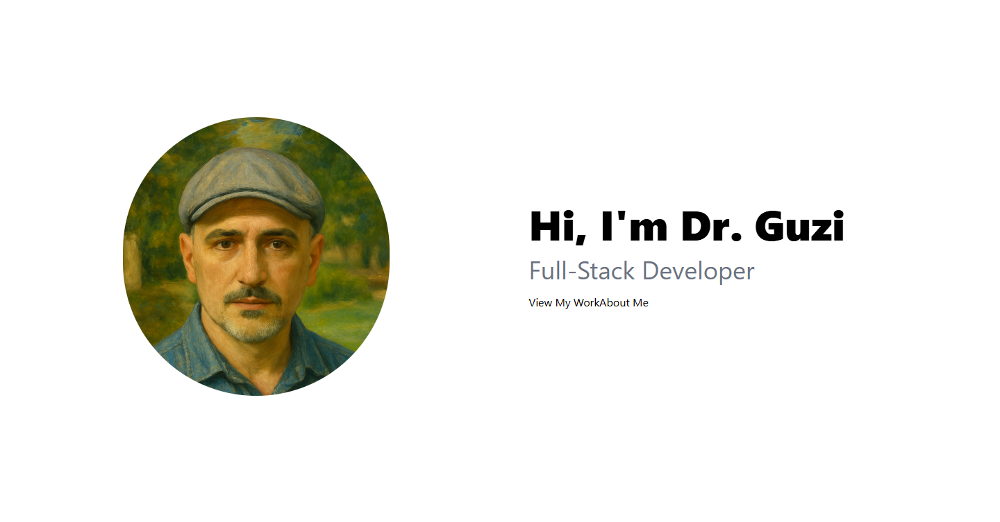

### 6. Where my buttons at?

Now for the hardest part! We're going to make the button from scratch. We can see some important parts about this button: the dark background (`bg-gray-800`), white text (`text-white`), slightly bolded text (`font-semibold`), rounded corners (`rounded-lg`), and some space between the edge of the button and the text (`px-4` and `py-3`). Let's start with the "View My Work" button and then go to the "About Me" button.

```jsx
<div className="flex flex-col gap-4">
    <div>
        <a
            href="#projects"
            className="pj-button bg-gray-800 text-white font-semibold px-4 py-3 rounded-lg"
        >
            View My Work
        </a>
        <a href="#about" className="cta-button">
            About Me
        </a>
    </div>
</div>
```

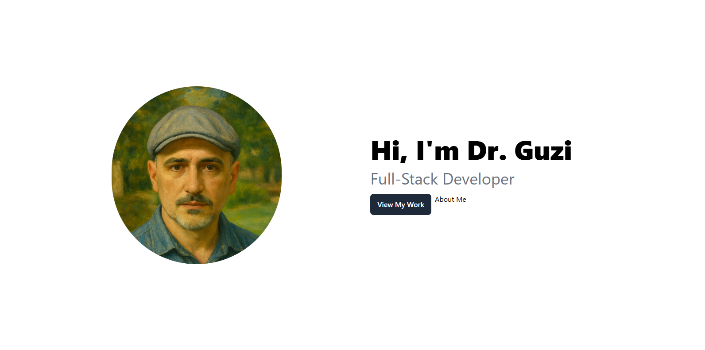

While we're here, let's make the buttons' container a flexbox as well and add some gap between them (only on the x axis, `gap-x-2`) to ensure they stay separate yet on the same line:

```jsx
<div className="flex gap-x-2">
    <a
        href="#projects"
        className="pj-button bg-gray-800 text-white font-semibold px-4 py-3 rounded-lg"
    >
        View My Work
    </a>
    <a href="#about" className="cta-button">
        About Me
    </a>
</div>         
``` 


We're so close! For the last button, it's similar but inverted. It has a white background (`bg-white`) with black text (`text-black`) and a border that's a light shade of grey (`border-2` and `border-gray-200`). We can copy most of the styles over from our other button and just change what we need.


We've done it! It's not super impressive, but we've managed to make something that genuinely looks good. Give yourself a pat on the back!

## Conclusion

Now you know a lot of Tailwind utilities you can go out and use to style your own websites, maybe even this one! As you get better, you'll learn that Tailwind is insanely fast at getting stuff looking gorgeous in no time at all. There's a reason it's so popular.

## Challenges

1. **Fix the Buttons** The buttons are slightly off---the text isn't centered and is getting pushed up! Can you fix it? 
    *   *Hint:* use flexbox to center stuff vertically and horizontally.

2.  **Style the Header:** Your `Header.jsx` component is currently unstyled. Using the Tailwind classes you learned (like `bg-`, `text-`, `p-`, `flex`, `justify-between`, `items-center`, `gap-`), give your header a distinct background color, add some padding, and use flexbox to nicely space out your site title/logo (if you have one) and the navigation links. Try styling the navigation links as well (e.g., change their color, maybe add a `hover:` effect to change color when the mouse is over them).
    *   *Hint:* You'll likely want the header container to be a `flex` container. `justify-between` is useful for pushing items to opposite ends, and `items-center` helps vertically align them. `gap-` can add space between the navigation links.

3.  **Enhance the Hero Buttons:** The current buttons look good, but let's add some interaction. Use Tailwind's `hover:` prefix to change the appearance of the buttons when the user hovers their mouse over them.
    *   For the "View My Work" button (`bg-gray-800`), try making the background slightly lighter on hover (e.g., `hover:bg-gray-700`).
    *   For the "About Me" button (`bg-white`), try adding a light gray background on hover (e.g., `hover:bg-gray-100`) or making the border darker (`hover:border-gray-400`).
    *   *Hint:* Add the `hover:` classes directly into the `className` string alongside the existing classes. Example: `className="... existing classes ... hover:bg-gray-700"`

### Hard Challenge: Making the Hero Section Responsive

Your Hero section looks great on a desktop, but what about smaller screens like tablets or phones? Right now, the image and text will likely stay side-by-side and might look squished or too large.

**Your Task:** Modify the Hero section (`Hero.jsx`) to be responsive using Tailwind's responsive prefixes (like `sm:`, `md:`, `lg:`).

1.  **Stack on Small Screens:** On small screens (mobile-first approach, so this is the default), make the image and the text stack vertically instead of being side-by-side.
    *   *Hint:* The parent `div` is currently `flex`. You might want it to be `flex-col` by default, and then change it back to `flex-row` (or just `flex`) only on larger screens using a prefix like `md:flex-row`.
2.  **Adjust Spacing and Alignment:** When stacked, ensure the items are centered and have appropriate spacing. You might need to adjust `gap-`, `justify-center`, and `items-center` for different screen sizes.
    *   *Hint:* You might want `items-center` by default, but maybe change `justify-center` behavior based on screen size. `gap-` values might also need responsive variants (e.g., `gap-8 md:gap-50`).
3.  **Resize Elements:** The image (`w-96`) and text (`text-6xl`, `text-4xl`) might be too large for small screens. Make them smaller by default, and use responsive prefixes to increase their size on larger screens.
    *   *Hint:* Example: `className="w-64 md:w-96"` or `className="text-4xl md:text-6xl"`
4.  **Test:** Use your browser's developer tools (usually F12) to simulate different screen sizes and ensure your layout adapts correctly.

This challenge requires understanding Tailwind's mobile-first approach and how to use prefixes like `md:` to apply styles *only* above a certain screen width breakpoint. Good luck!

# Additional Content: Normal CSS vs TailwindCSS

When you're writing **normal CSS**, you're doing things like this:

```css
/* styles.css */
.button {
    background-color: blue;
    color: white;
    padding: 1rem 2rem;
    border-radius: 0.5rem;
}
```

Then in your JSX:

```jsx
<button className="button">Click Me</button>
```

This means you gotta jump between your JSX and a .css file constantly. Not bad at first, but as the project grows, it’s like playing whack-a-mole with your styles. It can get out of hand quick.

TailwindCSS, on the other hand, is like giving up the paintbrush and just spray-painting your styles right in the HTML:

```jsx
<button className="bg-blue-500 text-white px-4 py-2 rounded">Click Me</button>
```

It might look ugly at first, but here's the kicker: you don't write custom CSS 95% of the time. It’s all utility classes. And it’s FAST. You think in terms of spacing, layout, color—just slam the classes in, and boom, you're done. Less switching files, fewer naming debates, no unused classes.

Normal CSS = separation of concerns.
Tailwind = atomic styling for high-speed.

You wanna scale fast, prototype quick, and keep consistent design tokens? Tailwind’s your guy. If you're gonna want highly custom stuff, then maybe stick with CSS or use both.
