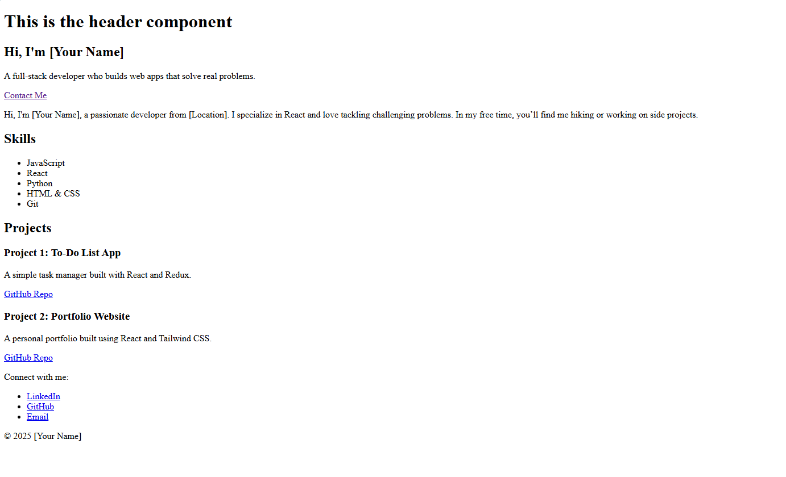
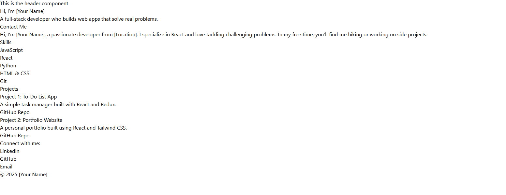
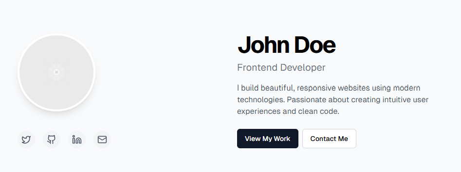
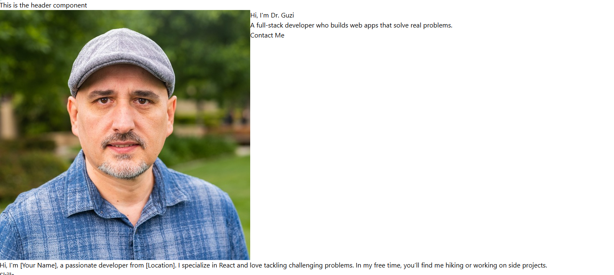
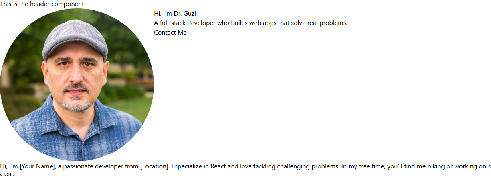
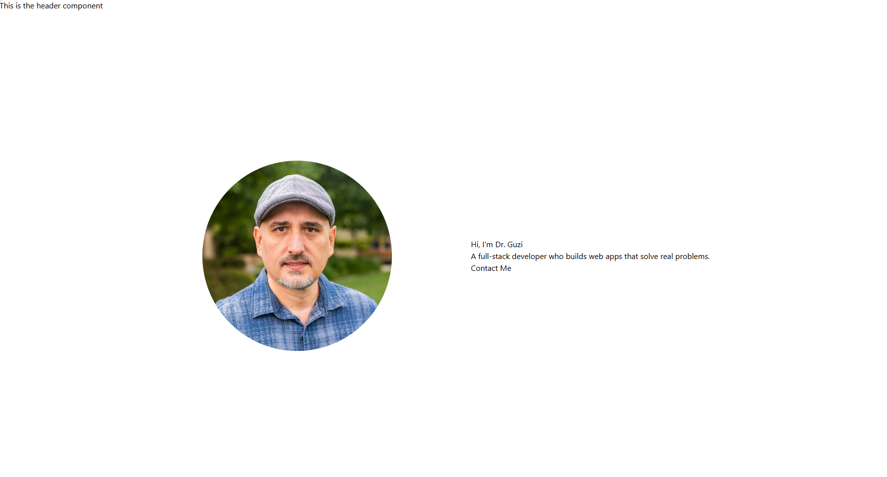

+++
date = '2025-04-08T21:25:53-07:00'
draft = false
title = 'Week 2 - Styling and Refactors'
+++

[Check out the completed GitHub repo for this week](https://github.com/jdgio2/cs-club-portfolio-w2)

## Objective

-   Clean up component structure a bit.
-   Install Tailwind into our project.
-   Use Tailwind to style the Hero and Header sections.

Today, we're going to turn our website from this 🤢:


To this:
(results may vary based on how cracked you are)


## Steps

### Refactoring Project Structure

We're going to start off by refactoring what we already have. Your project structure probably just has everything slapped into the `/src` folder. Let's just clean it up a bit so it's easier to navigate our project. You don't have to organize it in this way---this is just what I find most helpful.

1. Open your previous portfolio project in VSCode. Or, copy a completed template from [this link.](https://github.com/jdgio2/cs-club-portfolio-w1) If you're cloning, make sure to run `npm install` in the terminal once you open the project in VSCode.
2. Use `npm run dev` in the terminal to preview your project. Take a look at it again, it's probably been a second.
3. If you haven't already, delete the file `App.css`. Do not delete `index.css`.
4. Make a new folder in `/src` called `components`.
5. Drag everything into the folder except `main.jsx`, `App.jsx`, and `index.css`.
6. Update the imports inside `App.tsx`. They used to be:

```jsx
import About from "./About";
import Header from "./Header";
import Hero from "./Hero";
import Projects from "./Projects";
import Skills from "./Skills";
import Footer from "./Footer";
```

Since we moved everything, we want to change it to this instead:

```jsx
import About from "./components/About";
import Header from "./components/Header";
import Hero from "./components/Hero";
import Projects from "./components/Projects";
import Skills from "./components/Skills";
import Footer from "./components/Footer";
```

7. Reload your preview page in your browser to make sure it's working. It should look the same as before.

### TAILWIND TIME 🎉🎉🎉

Our website still looks like garbage. Let's add Tailwind so we can make it look slightly better. Let me warn you: we are not going to be able to cover all of Tailwind today. You can create crazy, complex, beautiful websites with Tailwind. All these setup instructions were pulled from [tailwindcss.com](https://tailwindcss.com/).

1. Stop your development terminal by pressing `ctrl+c` (it might be `cmd+c` on a Mac).
2. Copy and paste this into your terminal and hit enter: `npm install tailwindcss @tailwindcss/vite`.
3. Update your Vite configuration in `vite.config.js`. Pretty much, change it from this:

```js
import { defineConfig } from "vite";
import react from "@vitejs/plugin-react";

// https://vite.dev/config/
export default defineConfig({
    plugins: [react()],
});
```

to this:

```js
import { defineConfig } from "vite";
import react from "@vitejs/plugin-react";
import tailwindcss from "@tailwindcss/vite"; // new import

// https://vite.dev/config/
export default defineConfig({
    plugins: [react(), tailwindcss()], // new plugin
});
```

4. Go into `index.css` and paste in the following line: `@import "tailwindcss";`
5. Make sure you've saved all your changes, and then type `npm run dev` into the console again and re-open your preview. Your website should now look like this:
   

Tailwind is now working! If you're wondering why it looks like that, then you can go to [the additional content explaining the differences](#normal-css-vs-tailwindcss)

Let's start styling!

## Styling with TailwindCSS

We're just going to style the Hero section for now, and then I am going to just let you go off and do your own thing and style away.

I'm going to loosely copy this format for the hero that I got from an AI somewhere:


You can break this image down into two sections: the left side with the image, and the right side with the text and buttons. As a general rule in modern CSS, whenever we want to place two items next to each other, our beloved utility _flexbox_ will come into play. It literally just lets you position elements next to each other. Let's get into it.

1. First, I was missing the image in my `Hero.jsx` file. I went ahead and added it, going from this:

```jsx
// Hero.jsx
export default function Hero() {
    return (
        <section id="hero">
            <div className="hero-content">
                <h1>Hi, I'm [Your Name]</h1>
                <p>
                    A full-stack developer who builds web apps that solve real
                    problems.
                </p>
                <a href="#contact" className="cta-button">
                    Contact Me
                </a>
            </div>
        </section>
    );
}
```

to this:

```jsx
export default function Hero() {
    return (
        <section id="hero">
            <div className="hero-content">
                
                <h1>Hi, I'm Dr. Guzi</h1>
                <p>
                    A full-stack developer who builds web apps that solve real
                    problems.
                </p>
                <a href="#contact" className="cta-button">
                    Contact Me
                </a>
            </div>
        </section>
    );
}
```

2. Now, we discussed two containers before. We want to make sure that the image has its own container, and the text has its own container too. So let's go ahead and wrap them in divs, which we just use as dummy objects for holding any type of item:

```jsx
// Hero.jsx
export default function Hero() {
    return (
        <section id="hero">
            <div className="">
                <div>
                    
                </div>
                <div>
                    <h1>Hi, I'm Dr. Guzi</h1>
                    <p>
                        A full-stack developer who builds web apps that solve
                        real problems.
                    </p>
                    <a href="#contact" className="cta-button">
                        Contact Me
                    </a>
                </div>
            </div>
        </section>
    );
}
```

3. The website still isn't look right though, since there's just a giant Dr. Buzi and everything is on top of everything else: . How to fix?

4. It's time to use flexbox! In flexbox and in Tailwind, we add styles using the `className` property, like this:

```jsx
// Hero.jsx
export default function Hero() {
    return (
        <section id="hero">
            <div className="flex">
                <div>
                    
                </div>
                <div>
                    <h1>Hi, I'm Dr. Guzi</h1>
                    <p>
                        A full-stack developer who builds web apps that solve
                        real problems.
                    </p>
                    <a href="#contact" className="cta-button">
                        Contact Me
                    </a>
                </div>
            </div>
        </section>
    );
}
```

Now, they're next to each other .

5. Buzi is a little big, so we can add height and width properties to cut him down to size. Also, we want the image to be a circle, so let's add that as well:

```jsx

```

Here he is now: 

6. Also, the hero section should be nice and big, and I want everything centered. Let's make it the whole height of the screen and center everything, while adding a little gap between our two containers.

```jsx
// Hero.jsx
export default function Hero() {
    return (
        <section id="hero">
            <div className="flex h-screen justify-center items-center gap-40">
                <div>
                    
                </div>
                <div>
                    <h1>Hi, I'm Dr. Guzi</h1>
                    <p>
                        A full-stack developer who builds web apps that solve
                        real problems.
                    </p>
                    <a href="#contact" className="cta-button">
                        Contact Me
                    </a>
                </div>
            </div>
        </section>
    );
}
```



7. Getting there! The image looks pretty good, but let's change the text now. I want the "Hi, I'm Dr. Guzi" text to be big (`text-6xl`) and very bold (`font-black`), so let's add that too.

```jsx
// Hero.jsx
export default function Hero() {
    return (
        <section id="hero">
            <div className="flex h-screen justify-center items-center gap-40">
                <div>
                    
                </div>
                <div>
                    <h1 className="font-black text-6xl">Hi, I'm Dr. Guzi</h1>
                    <p>
                        A full-stack developer who builds web apps that solve
                        real problems.
                    </p>
                    <a href="#contact" className="cta-button">
                        Contact Me
                    </a>
                </div>
            </div>
        </section>
    );
}
```

8. I want the text below it to be a little smaller than that, but also be a little bit lighter. Let's add that too:

```jsx
// Hero.jsx
export default function Hero() {
    return (
        <section id="hero">
            <div className="flex h-screen justify-center items-center gap-40">
                <div>
                    
                </div>
                <div>
                    <h1 className="font-black text-6xl">Hi, I'm Dr. Guzi</h1>
                    <p className="text-4xl text-gray-500">
                        A full-stack developer who builds web apps that solve
                        real problems.
                    </p>
                    <a href="#contact" className="">
                        View My Work
                    </a>
                    <a href="#contact" className="">
                        Contact Me
                    </a>
                </div>
            </div>
        </section>
    );
}
```

9. Looks alright Dr. Buzi and the text are getting a little too wide, though, so let's add a max width to the parent container:

# This is incomplete, sorry 🙂

# Normal CSS vs TailwindCSS

When you're writing **normal CSS**, you're doing things like this:

```css
/* styles.css */
.button {
    background-color: blue;
    color: white;
    padding: 1rem 2rem;
    border-radius: 0.5rem;
}
```

Then in your JSX:

```jsx
<button className="button">Click Me</button>
```

This means you gotta jump between your JSX and a .css file constantly. Not bad at first, but as the project grows, it’s like playing whack-a-mole with your styles. It can get out of hand quick.

TailwindCSS, on the other hand, is like giving up the paintbrush and just spray-painting your styles right in the HTML:

```jsx
<button className="bg-blue-500 text-white px-4 py-2 rounded">Click Me</button>
```

It might look ugly at first, but here's the kicker: you don't write custom CSS 95% of the time. It’s all utility classes. And it’s FAST. You think in terms of spacing, layout, color—just slam the classes in, and boom, you're done. Less switching files, fewer naming debates, no unused classes.

Normal CSS = separation of concerns.
Tailwind = atomic styling for high-speed.

You wanna scale fast, prototype quick, and keep consistent design tokens? Tailwind’s your guy. If you're gonna want highly custom stuff, then maybe stick with CSS or use both.
