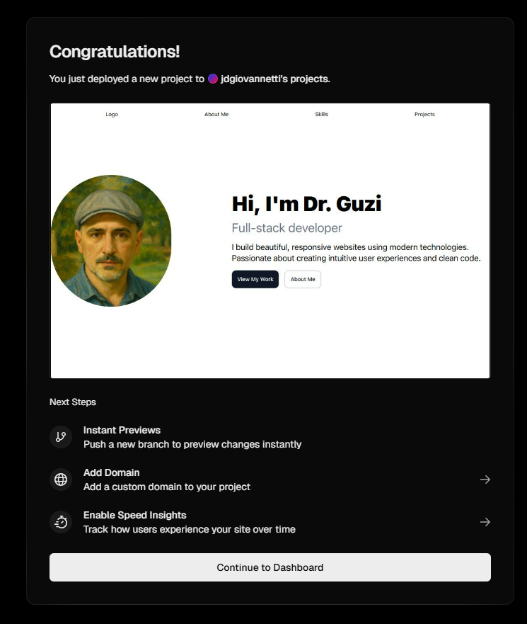

+++
date = '2025-04-23T15:57:56-07:00'
draft = false
title = 'Week 3 - Deployment' 
+++

[Check out the completed GitHub repo for this week](https://github.com/jdgio2/cs-club-portfolio-w2)

## Objective

-   Deploy our website so that anyone can see it.

At this point, you should have a nice and fancy website. Only issue is, it only lives on your computer right now. You want other people to access it just like any other website, and for that, we'll need a host.

Today, we'll be fully deploying your website so that you can show it off to anyone you like!

## Steps

### Push to GitHub Repository

What we need to do first is to get your project into a GitHub repository. I'm not going to go into too much detail here since it's not super complex, but here are some basic steps:

1. Make sure git is installed on your computer

```bash
git --version
```

If you don't see a version number, head over to [git-scm.com](git-scm.com) and download it.

2. Now, navigate to your project folder in the terminal and make double-check you're in the correct folder for your project:

```bash
cd path/to/your/portfolio-project
```

3. Initialize a new Git repository:

```bash
git init
```

4. Now, let's add and commit our files:

```bash
git add .
git commit -m "Initial commit of portfolio project"
```

5. Head on over to [GitHub](github.com) and log in (or create an account if needed).
6. Click the "+" button in the top right corner and select "New repository"
7. Name your repository (maybe "portfolio" or "my-portfolio-website")
8. Leave it public (unless you have specific reasons to make it private)
9. Don't initialize with a README since we already have our project
10. Click "Create repository"

After creating the repository, GitHub will show commands to connect your local repo. Since we already initialized our local repo, use these commands (don't copy paste from here though, they won't work---grab them from GitHub):

```bash
git remote add origin https://github.com/YOUR-USERNAME/YOUR-REPO-NAME.git
git branch -M main
git push -u origin main
```

Refresh your GitHub page and you should see all your portfolio files there!

### Deploying to Vercel

Vercel is a fantastic platform for deploying React apps with pretty much no effort. Let's get into it:

1. Go to Vercel and sign up/log in (using your GitHub account makes things easier)
2. Once logged in, click "Add New..." -> "Project"
3. Vercel will show your GitHub repositories - find and select your portfolio repo
4. For a standard React app, Vercel will automatically detect the correct settings
5. Under "Project Name" you can keep the default or choose something memorable
6. Leave the "Framework Preset" as "Vite"
7. Click "Deploy"
8. After a few seconds, you should be greeted with a page like this:
   
9. Click on that image to access your link. Here's mine!: [https://drguzi.vercel.app/](https://drguzi.vercel.app/)

That's it! You can give this link to people if you'd like and they'll be able to see your entire portfolio. The best part is, whenever you push to your GitHub repository, Vercel will automatically detect that push and pull the latest changes to your deployed website, so you don't have to go through anything!

# Conclusion

Over the last three weeks, you've gone from zero to a great little portfolio that you can show off your projects on! Great job!

There are some more things left to do that are outside of the scope of this tutorial, however:

## Taking Your Portfolio to the Next Level

### 1. Migrate to Next.js for Better SEO

While our current React setup works beautifully, consider migrating to Next.js to get some serious SEO benefits. Next.js offers server-side rendering and static site generation which means:

-   Search engines can better understand and index your content
-   Faster initial page loads for visitors
-   Built-in image optimization
-   Improved performance metrics

The migration process is surprisingly straightforward since Next.js supports React components, and the SEO boost could help your portfolio get discovered!

### 2. Add Eye-Catching Animations

Nothing says "skilled developer" like tasteful animations! Consider adding:

-   Smooth page transitions using Framer Motion
-   Scroll-triggered animations with GSAP (GreenSock Animation Platform)
-   Interactive hover effects on your project cards
-   Subtle background animations that don't distract but delight

Just a word of caution: with animations, less is often more. Focus on enhancing the user experience rather than distracting from your content.

### 3. Implement Proper Routing

As your portfolio grows, you might want dedicated pages for detailed project case studies or blog posts. Adding proper routing will make your site feel like a professional web application:

-   Use Next.js's built-in file-based routing system
-   Or implement React Router for client-side routing
-   Create clean, shareable links to specific sections of your portfolio
-   Add breadcrumbs for larger, more complex portfolios

### 4. Continuous Learning

Remember that a developer's portfolio is never truly "finished" - it evolves as you do! Keep adding new projects, refining your skills, and implementing new technologies you learn.

## Final Thoughts

What you've built over these three weeks is just the beginning. Your portfolio is now both your showcase and your playground - a place to demonstrate what you've learned and experiment with what you're learning next.

So go ahead and share your creation with the world! Add the link to your résumé, social media profiles, and coding community accounts. And most importantly - keep building, keep learning, and keep growing as a developer.

I can't wait to see where you take your portfolio from here! If you're ever looking for inspiration, [click here to find a huge number of portfolios to take notes from.](https://github.com/emmabostian/developer-portfolios) Maybe you could upload your own once you're done!

Thanks for hanging out! God bless.
